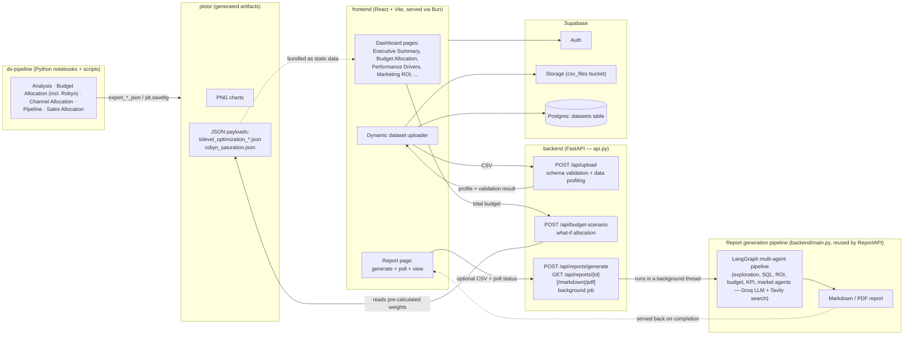
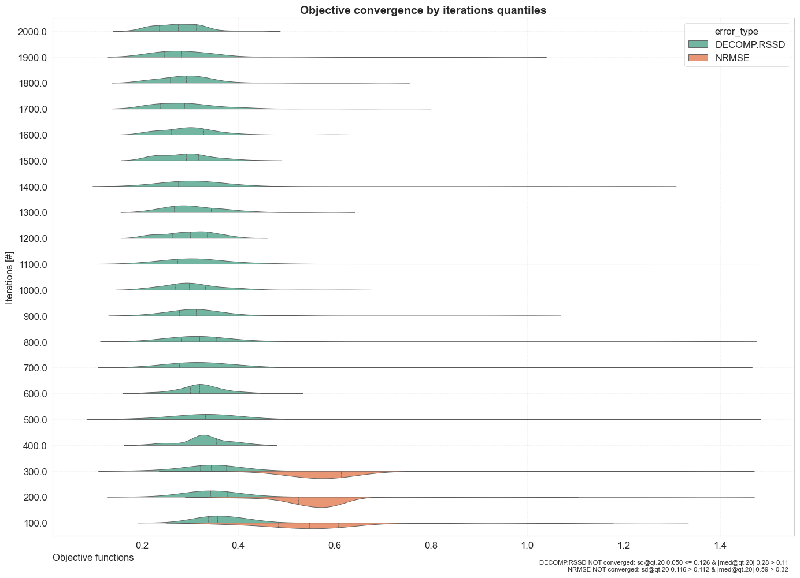
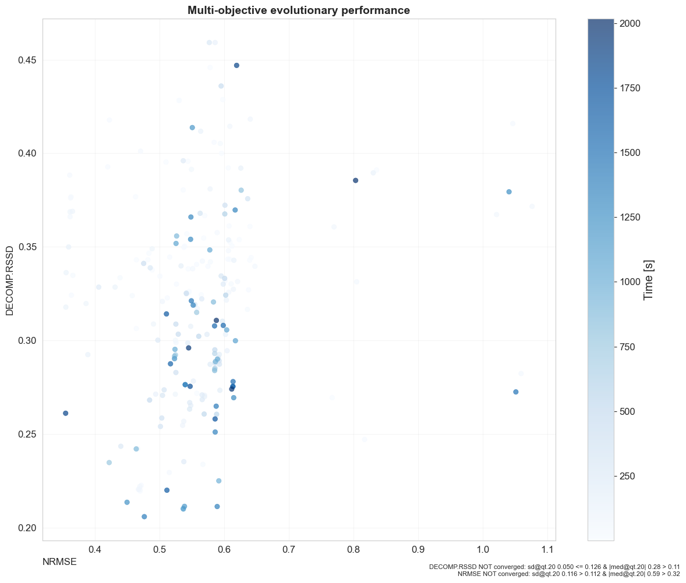
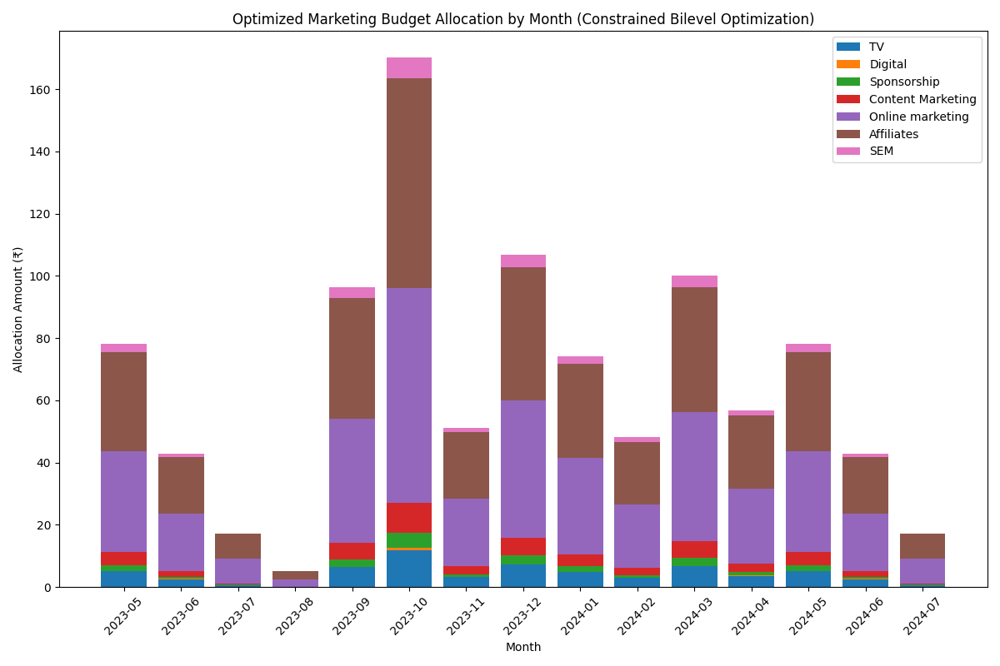
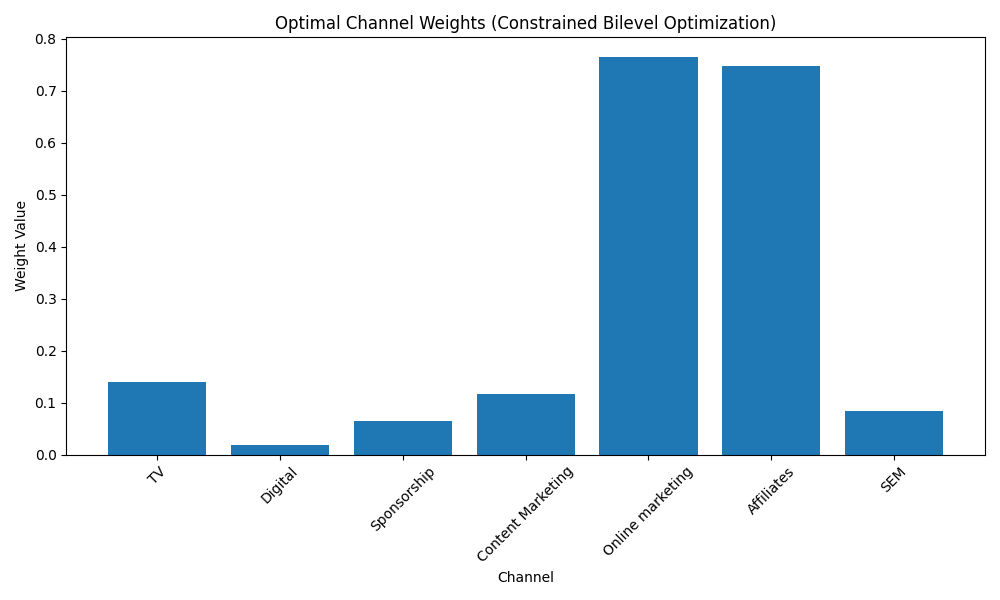

# Spendzone

Spendzone is a Marketing Mix Modeling (MMM) and budget optimization platform. It combines a Python data-science pipeline (Robyn-based MMM, bi-level budget optimization, channel/customer analytics) with a React dashboard and a small FastAPI layer, so marketing teams can see where their spend is working, simulate different budgets, and get a recommended dollar split across channels.

## Table of Contents

1. [Architecture](#architecture)
2. [Repository Structure](#repository-structure)
3. [Features](#features)
4. [Quickstart](#quickstart)
5. [Running with Docker](#running-with-docker)
6. [Environment Variables](#environment-variables)
7. [Deployment](#deployment)
8. [Reproducing the Numbers](#reproducing-the-numbers)
9. [Screenshots](#screenshots)
10. [Tech Stack](#tech-stack)
11. [Contributing](#contributing)
12. [License](#license)

## Architecture



The data-science pipeline produces PNG charts and JSON payloads (channel weights, allocation time series, saturation curves) that are consumed by the frontend either as bundled static data or through the two live FastAPI endpoints. Authentication, file storage, and the dataset catalog are handled by Supabase. Report generation (`backend/main.py`'s LangGraph multi-agent pipeline) runs as a background job behind `POST /api/reports/generate` — a real run makes several LLM calls per section and can take a few minutes, so the frontend's Report page polls job status rather than blocking on the request; only one report generates at a time, since the pipeline shares a single SQLite file and an in-process data-manager singleton.

## Repository Structure

```
Spendzone-Analytics/
├── frontend/          React + Vite dashboard (Bun-managed)
├── ds-pipeline/        Data science: EDA, budget optimization, Robyn MMM
│   ├── Analysis/            Channel effectiveness, LIME/SHAP interpretability
│   ├── Budget Allocation/   Time-series, bi-level optimization, Robyn MMM
│   ├── Channel Allocation/  Product-wise channel allocation
│   ├── Pipeline/            Core EDA framework (customer/product/weather/investment)
│   └── Sales Allocation/    Sales performance analysis
├── backend/            FastAPI wrapper (api.py) + AI report generation (main.py)
└── plots/              Centralized output: generated PNGs and JSON payloads
```

## Features

- **Marketing Mix Modeling** — Meta's Robyn framework fits adstock (carryover) and Hill saturation (diminishing returns) curves per channel.
- **Bi-level Budget Optimization** — a constrained optimizer finds the channel weights and month-by-month allocation that maximize a log-based diminishing-returns revenue model.
- **What-If Scenario Modeling** — enter any total budget and get the exact recommended dollar split, computed live via `/api/budget-scenario` using the same optimization logic as the notebook.
- **Dynamic Dataset Upload** — upload a marketing spend CSV (`Date, Channel, Spend, Conversions`); it's validated against that schema and automatically profiled (cardinality, missingness %, standard deviation per column) before being stored.
- **Interactive Dashboards** — executive summary, marketing performance, ROI, performance drivers, and budget allocation views, with a date-range picker that filters the underlying JSON metrics.
- **AI-Powered Reporting** — the Report page's "Generate Report" button kicks off a real background job (`POST /api/reports/generate`, optionally with one or more of your own CSVs — each becomes its own queryable table), polls it while a LangGraph multi-agent pipeline (exploration, SQL, ROI, budget, KPI, market analysis agents) analyzes the data section by section, then renders the real generated markdown and a downloadable PDF once it completes — a full run takes a few minutes given the number of LLM calls involved. `scripts/generate_sample_data.py` generates synthetic CSVs to try this (and the rest of the platform) without real proprietary data.
- **Resilient UI** — a React error boundary isolates rendering failures (e.g. malformed model output) to the affected page instead of crashing the whole app.

## Quickstart

Want the fastest path to a running instance? Skip to [Running with Docker](#running-with-docker) — it only needs Docker installed, not Bun/Python/Poetry locally.

### Clone the repository

```bash
git clone <this-repo-url>
cd Spendzone-Analytics
```

Everything below (`frontend/`, `ds-pipeline/`, `backend/`) is a subdirectory of this repo root.

### Prerequisites

- [Bun](https://bun.sh) (frontend package manager & dev server)
- Python 3.10+ with `pip` (or Conda), for `ds-pipeline`
- Python 3.12+ with [Poetry](https://python-poetry.org), for `backend`
- A [Supabase](https://supabase.com) project (Auth + Storage + Postgres)

### Frontend

```bash
cd frontend
bun install
cp .env.example .env   # fill in your Supabase project URL/key
bun run dev
```

### Backend API (FastAPI)

```bash
cd backend
poetry install
cp .env.example .env   # GROQ_API_KEY / GEMINI_API_KEY / TAVILY_API_KEY
poetry run uvicorn api:app --reload --port 8000
```

The frontend's `VITE_API_BASE_URL` (default `http://localhost:8000`) should point at this server for CSV validation/profiling and what-if scenarios to work.

### Data Science Pipeline

```bash
cd ds-pipeline
python -m venv .venv
.venv\Scripts\activate      # Windows (macOS/Linux: source .venv/bin/activate)
pip install -r requirements.txt
pip install -r requirements-dev.txt   # Jupyter + testing utilities
jupyter notebook "Budget Allocation/Budget_Bioptimisation.ipynb"
```

`.venv/` is gitignored — keep pandas/scipy/scikit-learn/etc. scoped to this folder rather than installing into your system Python, so version pins here don't clash with other projects.

Running `Budget_Bioptimisation.ipynb` and `Robyn.ipynb` end-to-end regenerates the PNGs and JSON payloads under `../plots/`, which the frontend and backend both read from.

## Running with Docker

The fastest way to try Spendzone locally: this doesn't need Bun, Python, or Poetry installed on your machine at all — just [Docker](https://www.docker.com/products/docker-desktop/).

```bash
git clone <this-repo-url>
cd Spendzone-Analytics
cp frontend/.env.example frontend/.env   # fill in your Supabase project URL/key
cp backend/.env.example backend/.env     # fill in GROQ_API_KEY / GEMINI_API_KEY / TAVILY_API_KEY
docker compose up --build
```

- Frontend (live-reloading Vite dev server): **http://localhost:5173**
- Backend API: **http://localhost:8000** (`/api/health`, `/api/upload`, `/api/budget-scenario`)

Both services bind-mount their source directory, so editing a file on your host hot-reloads inside the container — the Docker setup is for iterating locally, not a packaging step you need to think about while developing.

Optional: the data-science notebooks (Robyn MMM, bi-level budget optimization) as a container-local Jupyter server, off by default since it's a sandbox for exploring the notebooks rather than a deployed service:

```bash
docker compose --profile ds-pipeline up --build ds-pipeline
```

Then open **http://localhost:8888**.

**Notes**
- This mirrors the real deployment shape (a static frontend + a standalone Python API) without needing two separate local toolchains — it does not change how anything actually ships (see [Deployment](#deployment)).
- The backend image installs system libraries for `weasyprint` (used by the PDF report generator) and R (needed by `robynpy`'s `rpy2` dependency in the ds-pipeline image) — this is exactly the kind of environment drift Docker is meant to paper over; you don't need either installed on your host.
- `docker compose logs -f frontend` / `backend` / `ds-pipeline` to tail logs; `docker compose down` to stop everything.

## Environment Variables

Each project has its own `.env.example` — copy it to `.env` and fill in real values (never commit `.env`).

**`frontend/.env.example`**
| Variable | Purpose |
|---|---|
| `VITE_SUPABASE_URL` | Supabase project URL |
| `VITE_SUPABASE_PUBLISHABLE_KEY` | Supabase anon/publishable key |
| `VITE_API_BASE_URL` | Base URL of the backend FastAPI app (optional in dev) |

**`backend/.env.example`**
| Variable | Purpose |
|---|---|
| `GROQ_API_KEY` | **Required** for `/api/reports/generate` — every report-generation agent's LLM calls |
| `GROQ_MODEL` | Optional override for the Groq model used by those agents (default `openai/gpt-oss-120b`). Groq's model catalog and per-account entitlements change over time — some accounts no longer have access to the Llama chat models (e.g. `llama-3.3-70b-versatile`) this project originally used, which surfaces as a `model_not_found` 404. Check https://console.groq.com/docs/models (or your own console's Playground model dropdown) if the default stops working, and pick a model that supports tool calling — every agent here uses it |
| `TAVILY_API_KEY` | Optional but recommended — powers the market-analysis agent's web search (used in the Business Context and Implementation sections); those two sections report a per-section error without it, the rest of the report is unaffected |
| `GEMINI_API_KEY` | Google Gemini (sequential report generator) — not used by the current `/api/reports/generate` pipeline |

## Deployment

- **Frontend** — deploys to [Vercel](https://vercel.com) directly from this repo (root directory `frontend/`, `bun run build` / `dist`). `frontend/vercel.json` already provides the SPA rewrite. Set the `VITE_*` variables from the table above in the Vercel project's environment settings, pointing `VITE_API_BASE_URL` at wherever the backend is hosted.
- **Backend** — a standard ASGI app (`uvicorn api:app`), deployable to any host that runs a long-lived Python process or container: Railway, Fly.io, a plain VM, etc. `backend/Dockerfile` doubles as that deployable artifact — most hosts with container support can build and run it as-is (its default `CMD` is already production-safe, no `--reload`); on a host without container support, `poetry install && uvicorn api:app --host 0.0.0.0 --port $PORT` covers it. Either way, set the `GROQ_API_KEY` / `GEMINI_API_KEY` / `TAVILY_API_KEY` variables and update `allow_origins` in `api.py`'s CORS middleware to your deployed frontend's origin (it's currently `*` for local development).

## Reproducing the Numbers

Every performance/accuracy/cost claim about this platform is backed by a committed,
runnable measurement, not a quoted figure — see [`docs/METRICS.md`](docs/METRICS.md).
Each entry there states the exact claim, the exact command that produces it, the raw
output, and what the result does and does not support (including where a measurement
came back weaker than hoped, or couldn't be run at all). Supporting scripts live in
`scripts/metrics/`.

## Screenshots

**Robyn MMM — model convergence & fit**




**Bi-level Budget Optimization**




<!-- Dashboard UI screenshots pending — add e.g. docs/screenshots/executive-summary.png once captured from a running instance -->
<!--  -->

## Tech Stack

| Layer | Technologies |
|---|---|
| Frontend | React, TypeScript, Vite, Tailwind CSS, shadcn/ui, Recharts, Supabase JS |
| Backend API | FastAPI, Pandas, SciPy, Uvicorn |
| Report Generation | LangChain, LangGraph, Groq, Gemini, ReportLab/WeasyPrint |
| Data Science | Pandas, NumPy, SciPy, scikit-learn, statsmodels, LIME, SHAP, Robyn (robynpy) |
| Infrastructure | Supabase (Auth, Storage, Postgres), Vercel (frontend hosting), Docker Compose (local/CI testing) |

## Contributing

Contributions are welcome:

1. Fork the repository
2. Create a feature branch (`git checkout -b feature/amazing-feature`)
3. Commit your changes (`git commit -m 'Add some amazing feature'`)
4. Push to the branch (`git push origin feature/amazing-feature`)
5. Open a Pull Request

## License

MIT — see [LICENSE](LICENSE).
