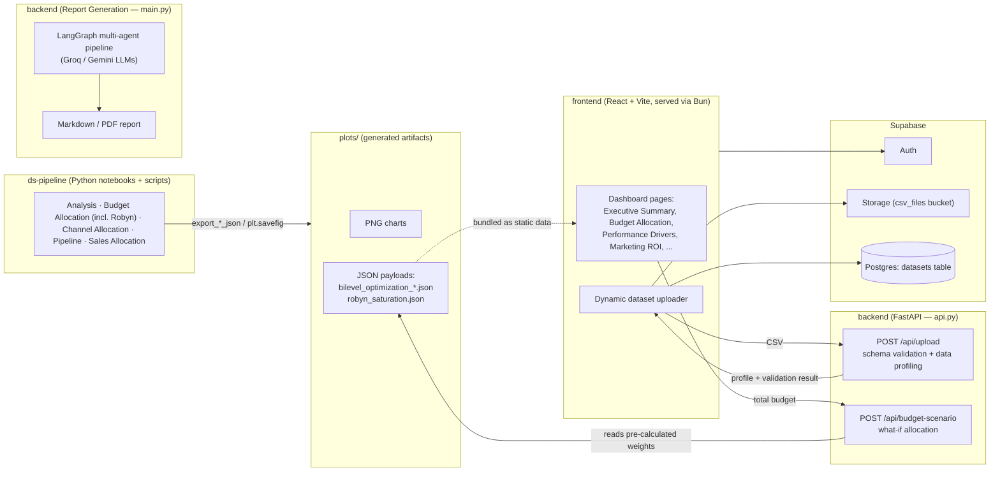

# Spendzone

Spendzone is a Marketing Mix Modeling (MMM) and budget optimization platform. It combines a Python data-science pipeline (Robyn-based MMM, bi-level budget optimization, channel/customer analytics) with a React dashboard and a small FastAPI layer, so marketing teams can see where their spend is working, simulate different budgets, and get a recommended dollar split across channels.

## Table of Contents

1. [Architecture](#architecture)
2. [Repository Structure](#repository-structure)
3. [Features](#features)
4. [Quickstart](#quickstart)
5. [Environment Variables](#environment-variables)
6. [Screenshots](#screenshots)
7. [Tech Stack](#tech-stack)
8. [Contributing](#contributing)
9. [License](#license)

## Architecture



The data-science pipeline produces PNG charts and JSON payloads (channel weights, allocation time series, saturation curves) that are consumed by the frontend either as bundled static data or through the two live FastAPI endpoints. Authentication, file storage, and the dataset catalog are handled by Supabase. Report Generation is a separate multi-agent script that produces a standalone Markdown/PDF report and is not yet wired to an HTTP endpoint.

## Repository Structure

```
Spendzone-Analytics/
├── frontend/          React + Vite dashboard (Bun-managed)
├── ds-pipeline/        Data science: EDA, budget optimization, Robyn MMM
│   ├── Analysis/            Channel effectiveness, LIME/SHAP interpretability
│   ├── Budget Allocation/   Time-series, bi-level optimization, Robyn MMM
│   ├── Channel Allocation/  Product-wise channel allocation
│   ├── Pipeline/            Core EDA framework (customer/product/weather/investment)
│   └── Sales Allocation/    Sales performance analysis
├── backend/            FastAPI wrapper (api.py) + AI report generation (main.py)
└── plots/              Centralized output: generated PNGs and JSON payloads
```

## Features

- **Marketing Mix Modeling** — Meta's Robyn framework fits adstock (carryover) and Hill saturation (diminishing returns) curves per channel.
- **Bi-level Budget Optimization** — a constrained optimizer finds the channel weights and month-by-month allocation that maximize a log-based diminishing-returns revenue model.
- **What-If Scenario Modeling** — enter any total budget and get the exact recommended dollar split, computed live via `/api/budget-scenario` using the same optimization logic as the notebook.
- **Dynamic Dataset Upload** — upload a marketing spend CSV (`Date, Channel, Spend, Conversions`); it's validated against that schema and automatically profiled (cardinality, missingness %, standard deviation per column) before being stored.
- **Interactive Dashboards** — executive summary, marketing performance, ROI, performance drivers, and budget allocation views, with a date-range picker that filters the underlying JSON metrics.
- **AI-Powered Reporting** — a LangGraph multi-agent pipeline (exploration, SQL, ROI, budget, KPI, market analysis agents) generates a full marketing analysis report.
- **Resilient UI** — a React error boundary isolates rendering failures (e.g. malformed model output) to the affected page instead of crashing the whole app.

## Quickstart

### Prerequisites

- [Bun](https://bun.sh) (frontend package manager & dev server)
- Python 3.10+ with `pip` (or Conda), for `ds-pipeline`
- Python 3.12+ with [Poetry](https://python-poetry.org), for `backend`
- A [Supabase](https://supabase.com) project (Auth + Storage + Postgres)

### Frontend

```bash
cd frontend
bun install
cp .env.example .env   # fill in your Supabase project URL/key
bun run dev
```

### Backend API (FastAPI)

```bash
cd backend
poetry install
cp .env.example .env   # GROQ_API_KEY / GEMINI_API_KEY / TAVILY_API_KEY
poetry run uvicorn api:app --reload --port 8000
```

The frontend's `VITE_API_BASE_URL` (default `http://localhost:8000`) should point at this server for CSV validation/profiling and what-if scenarios to work.

### Data Science Pipeline

```bash
cd ds-pipeline
pip install -r requirements.txt
pip install -r requirements-dev.txt   # Jupyter + testing utilities
jupyter notebook "Budget Allocation/Budget_Bioptimisation.ipynb"
```

Running `Budget_Bioptimisation.ipynb` and `Robyn.ipynb` end-to-end regenerates the PNGs and JSON payloads under `../plots/`, which the frontend and backend both read from.

## Environment Variables

Each project has its own `.env.example` — copy it to `.env` and fill in real values (never commit `.env`).

**`frontend/.env.example`**
| Variable | Purpose |
|---|---|
| `VITE_SUPABASE_URL` | Supabase project URL |
| `VITE_SUPABASE_PUBLISHABLE_KEY` | Supabase anon/publishable key |
| `VITE_API_BASE_URL` | Base URL of the backend FastAPI app (optional in dev) |

**`backend/.env.example`**
| Variable | Purpose |
|---|---|
| `GROQ_API_KEY` | Groq LLM inference (report generation agents) |
| `GEMINI_API_KEY` | Google Gemini (sequential report generator) |
| `TAVILY_API_KEY` | Tavily web search (market analysis agent) |

## Screenshots

**Robyn MMM — model convergence & fit**


**Bi-level Budget Optimization**


<!-- Dashboard UI screenshots pending — add e.g. docs/screenshots/executive-summary.png once captured from a running instance -->
<!--  -->

## Tech Stack

| Layer | Technologies |
|---|---|
| Frontend | React, TypeScript, Vite, Tailwind CSS, shadcn/ui, Recharts, Supabase JS |
| Backend API | FastAPI, Pandas, SciPy, Uvicorn |
| Report Generation | LangChain, LangGraph, Groq, Gemini, ReportLab/WeasyPrint |
| Data Science | Pandas, NumPy, SciPy, scikit-learn, statsmodels, LIME, SHAP, Robyn (robynpy) |
| Infrastructure | Supabase (Auth, Storage, Postgres), Vercel (frontend hosting) |

## Contributing

Contributions are welcome:

1. Fork the repository
2. Create a feature branch (`git checkout -b feature/amazing-feature`)
3. Commit your changes (`git commit -m 'Add some amazing feature'`)
4. Push to the branch (`git push origin feature/amazing-feature`)
5. Open a Pull Request

## License

MIT — see [LICENSE](LICENSE).
